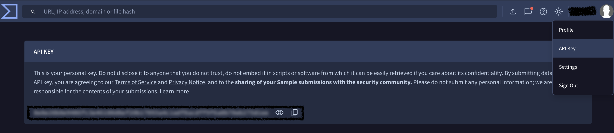

# 🛡️ VirusTotal IP Checker

> Automatically checks a list of IP addresses against VirusTotal and generates a clean Excel report — in seconds.


---

## 📋 What it does

- Paste your IP list into the script
- It checks every IP against the VirusTotal API automatically
- Saves a clean Excel file with 3 columns:

| Column | Description |
|---|---|
| Source Address | The IP address |
| Status | `Malicious` or `Clean` |
| VT Rating | e.g. `5//94` — engines that flagged it |

- If the daily API limit runs out mid-run, progress is saved automatically and resumes the next day from where it stopped

---

## ⚙️ Requirements

- Python 3
- Free VirusTotal API key → https://www.virustotal.com

---

## 🔑 How to get your VirusTotal API Key

**Step 1 —** Go to https://www.virustotal.com and create a free account

**Step 2 —** After logging in, click your **profile icon** at the top right

**Step 3 —** Click **API Key** from the dropdown menu



**Step 4 —** Copy your API key and paste it into the script:
```python
VT_API_KEY = "paste_your_key_here"
```

> ⚠️ Never share your API key with anyone or upload it to a public repository

---

## 🍎 Installation — Mac

<details>
<summary>Click to expand</summary>

**Step 1 — Install Homebrew**
```bash
/bin/bash -c "$(curl -fsSL https://raw.githubusercontent.com/Homebrew/install/HEAD/install.sh)"
```

**Step 2 — If Terminal says "brew not found"**
```bash
export PATH="/opt/homebrew/bin:$PATH"
```

**Step 3 — Install Python**
```bash
brew install python
```

**Step 4 — Create a virtual environment**
```bash
python3 -m venv ~/vt_env
```

**Step 5 — Activate the virtual environment**
```bash
source ~/vt_env/bin/activate
```
> You will see `(vt_env)` appear at the start of your terminal line

**Step 6 — Install required libraries**
```bash
pip install requests openpyxl
```

</details>

---

## 🪟 Installation — Windows

<details>
<summary>Click to expand</summary>

**Step 1 — Download Python**

Go to https://www.python.org/downloads/ and click Download. Run the installer.

> ⚠️ Important — tick **"Add Python to PATH"** at the bottom before clicking Install

**Step 2 — Open Command Prompt**

Press `Windows key + R`, type `cmd`, press Enter

**Step 3 — Verify Python installed**
```
python --version
```

**Step 4 — Install required libraries**
```
pip install requests openpyxl
```

</details>

---

## 🚀 How to use

**Step 1 — Add your API key**

Open `vt_ip_checker.py` and paste your key:
```python
VT_API_KEY = "your_api_key_here"
```

**Step 2 — Paste your IPs**
```python
IP_LIST = """
1.2.3.4
5.6.7.8
9.10.11.12
""".strip()
```

**Step 3 — Run the script**

On Mac:
```bash
source ~/vt_env/bin/activate
python3 vt_ip_checker.py
```

On Windows:
```
python vt_ip_checker.py
```

**Step 4 — Get your Excel file**

Saved automatically in the same folder:
```
IP_Threat_Analysis_2026-03-20.xlsx
```

---

## 🔄 Daily Usage

| Platform | Command |
|---|---|
| Mac | `source ~/vt_env/bin/activate` then `python3 vt_ip_checker.py` |
| Windows | `python vt_ip_checker.py` |

---

## ⚠️ API Limit Handling

The free VirusTotal API allows **500 requests/day**.

If the limit runs out mid-run:
1. Script stops automatically and saves progress to `progress.json`
2. Remaining IPs are marked as **Pending** in the Excel file
3. Next day — just run the script again, it resumes from where it stopped
4. Once all IPs are done, `progress.json` is deleted automatically

---

## 📝 Notes

- 🔒 Keep this repository **Private** — your API key is inside the script
- 📊 VT scores may vary slightly between runs — VirusTotal updates in real time, this is normal
- 🔢 The script always preserves the exact order of IPs as pasted